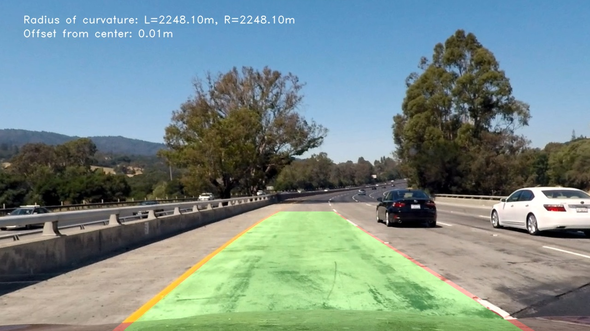

## Advanced Lane Finding

Overview
---

This project is the submission for Project#2 "Advanced Lane Detection" of the Udacity's Self Driving Nano-Degree course and builds on top of [Project#1 "Lane Line Detection"](https://github.com/yashgorana/lane-detection-basic).

This project detects lane lines in images & videos using Python and OpenCV.

**The writeup about the implementation is [available here](./WRITEUP.md)**

## Getting Started

### Pre-requisites

* Python 3+
* Visual Studio Code

### Setup

If using Anaconda, follow [this guide](https://github.com/udacity/CarND-Term1-Starter-Kit/blob/master/doc/configure_via_anaconda.md)

For bare-bones Python 3, install the required dependencies by running

    $ pip install -r requirements.txt

## Usage

### Jupyter Notebook

`P2.ipynb` contains the implementation of the image processing pipeline for detecting lanes.
The notebook will generate two directories `test_images_output/` and `test_videos_output/` containing the output of the pipeline.

To open the `P2.ipynb` Jupyter Notebook, simply run the following and open the notebook file in Jupyter browser file explorer

    $ jupyter notebook

## License

[MIT](./LICENSE)

