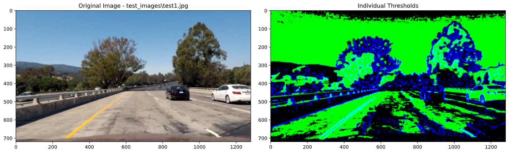
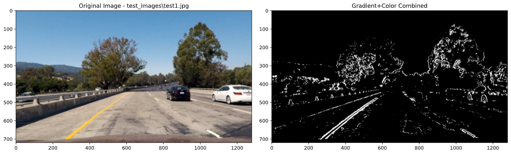
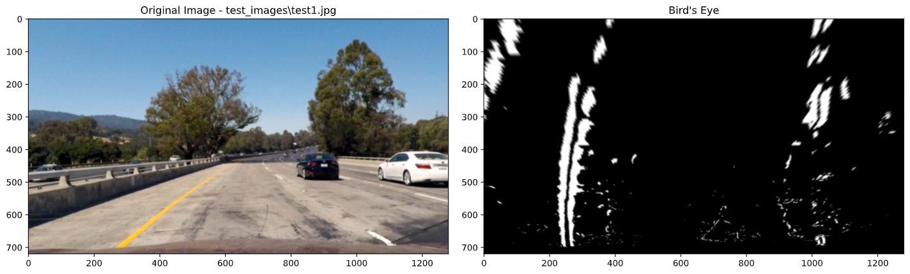
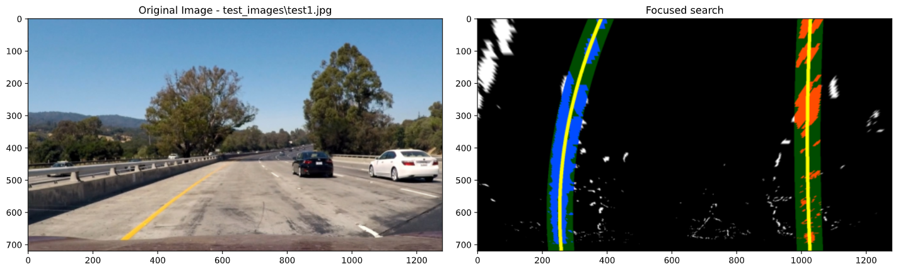
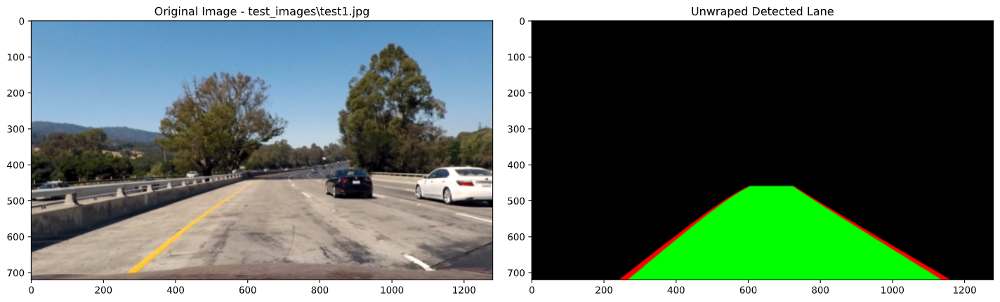
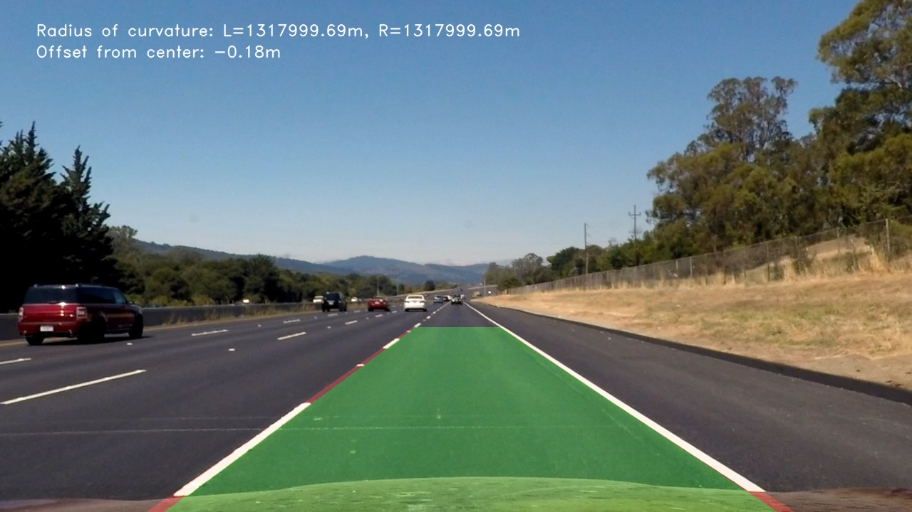

# **Advanced Lane Detection** 

The objective of this project:

- Use computer vision to engineer and extract features and filtering criteria for identifying lane lines on the road.
- Fix camera distortion by generating calibration matrix & distortion coefficients.
- Detect lane pixels and fit to find curved lane boundary.
- The output video is an annotated version of the input video.
- Left and right lanes should be accurate throughout the video
- Determine the curvature of the lane and vehicle offset from the centre.

This implementation builds on top of [Project#1 "Lane Line Detection"](https://github.com/yashgorana/lane-detection-basic).

## Ideas

#### Thresholding

While Sobel gradient, magnitude and direction thresholds help detect vertical edges, we also need ways to filter out any unnecessary edges on the roads. For this, we can think of selecting only those Sobel edges that also happen to be lane markers (yellow or white pixels).

**Colour Threshold**

To select white and yellow colours with accuracy, we can expand on top of our [previous exploration](https://github.com/yashgorana/lane-detection-basic/blob/master/WRITEUP.md#colour-selection) of using the HSB colour space. The idea is to use multiple colour spaces to select bright, medium, and dull yellows & whites.

The potential colour spaces are

- HLS: L & S channel can help filter out brighter parts of the image.
- LAB: the B channel picks up yellows better than HLS and HSV.
- YUV: Y & V channel can filter out brighter parts of the image. Overall it performs more or less the same as LAB colour space.

**Combining Threshold**

To select only those edges that are yellow and white pixel, we can perform AND operation between both Sobel & Gradient threshold.

#### Lane History

We can preserve the last "n" lane detections and average them to smooth out the lane detection. More importantly, in cases where the algorithm cannot detect any lanes, we can just return the previous lane detection from lane history

#### Optimizing computation

To make our pipeline as performant as possible, we try to leverage as much pre-computed data wherever required and avoid re-computation wherever possible. 

One such optimization is to find Sobel magnitude and direction without having to compute Sobel Gradient in both X & Y directions again and again.

Another place to optimise is by re-using lane pixel indices during histogram/focused search while detecting lanes. 

#### Project Structure

All the Python source files are present in the `src` module where each source file only exposes a specific functionality

- `src/utils.py` has utility functions mostly used by the notebook.
- `src/camera.py` includes implementation and other utilities for calibrating the camera.
- `src/warp.py` has functions for transforming perspective.
- `src/threshold.py` includes all functions for performing Sobel & Color thresholds.
- `src/lane.py` contains the lane detection algorithm.
- `src/measurements.py` has functions for computing lane measurements.
- `src/pipeline.py` implements a class that runs and preserves the state of lane detection algorithm. Along with this it also implements all the draw calls to render lanes, metrics, overlays, etc.

Overall this design modularizes our lane detection and abstracts away a lot of technical things not otherwise not required by the caller.

## Pipeline

Based on the above ideas, the image processing pipeline goes through 7 stages before displaying the final detected lane.
The configurable pipeline is implemented in `src.pipeline.LaneDetection` which runs the lane detection algorithm.

#### 1. Undistort Image

The first stage in the pipeline undistorts the source image by using a camera distortion matrix. The calibration matrix & coefficients are computed using the calibration images in `camera_cal/` directory and the result is stored in the `camera_cal/calibration.dat` file.

The class `src.camera.Camera` simplifies the process calibration, loading & saving the result in a concise call pattern.

The function `Camera.undistort(image, calib_data)` is used to undistort the image.


#### 2. Gradient + Color Threshold

This stage leverages our idea of selecting only those edges that are lanes. The class `src.threshold.Threshold` implements all the Sobel and colour thresholding routines.

As the name suggests, function `Threshold.combined_threshold()` will perform a logical AND between Sobel & Colour Threshold to detect edges that are lane edges.

```
    @staticmethod
    def combined_threshold(img, sobel_thresh, hsv_thresh, hls_thresh, lab_thresh, **kwargs):
        grad = Threshold.gradient(img, sobel_thresh)
        hls = Threshold.filter_hls(img, hls_thresh)
        hsv = Threshold.filter_hsv(img, hsv_thresh)
        lab = Threshold.filter_lab(img, lab_thresh)
        return grad & (hls | hsv | lab)
```



Here, the blue colour represents Sobel gradient thresholds and the green represents the HLS/HSV/LAB combined colour thresholds. If we notice carefully, the lane lines have CYAN (combination of both) which we can filter out using the AND operation.

#### 3. Bird's Eye View

This stage performs perspective transform on our binary image to get a "bird's eye" view of the road. The class `src.warp.Warp` has all the functions for getting the perspective and inverse perspective transform matrix.

The transformation uses hand-picked source and destination warp points. These values are returned through a function called `Warp.get_default_warp_points()`

The function`Warp.warp_image()` is invoked with binary image and the warp points to generate a perspective transform matrix (M) and an inverse perspective transform matrix (`M_inv`) 



The result is a binary image of bird's eye view of the road  

#### 4. Find Lane Lines

The lane detection stage is responsible for fitting a curve from the bird's eye binary image. The algorithm takes previous lane detection into account, before deciding which method to use for searching the lanes.

If there's no lane history, i.e. first frame or any reset scenarios, it will use the "**Histogram Search**" else it will take the last lane detection data and perform a "**Focused Search**".

The class `src.lane.FindLanes` implements all functions required for detecting lane lines

**Histogram search**

This method of search finds peaks in the histogram of the binary image and runs a sliding window search from the bottom to the top of the image.

The function `FindLanes.histogram_search()` performs this search by taking in a binary image and returning the following dictionary.

```
{
	"type": "histogram_search",
	"lane_pixels": (left_x, left_y, right_x, right_y),
	"sliding_windows": sliding_windows,
	"histogram": histogram,
}
```

Where type is the type of search performed. lane_pixels are all the pixel locations. sliding_windows has locations of all the sliding windows, and finally, the histogram used for the search.


**Focused search**

This search takes in the previous fit and generates a region around it where the lane pixels are searched.

The function `FindLanes.focused_search()` runs this search &  returns the following dictionary

```
{
	"type": "focused_search",
	"lane_pixels": (left_x, left_y, right_x, right_y),
	"region_points": (left_search_region, right_search_region),
	"search_width": search_width,
}
```

Similar to histogram search, `type` is the type of search and `lane_pixels` is all the lane pixel locations. `region_points` includes the pixels of the region of search and `search_width` is the thickness of the same region.



**Averaging the detections**

Finally, once the search yields pixel locations, this step fits a polynomial of degree 2. It also returns a weighted average of current fit with all the previous fits (max 10). The weights are decided based on which lane detection to prioritize

- Any abrupt changes in lanes curvature must be taken into consideration. Or in other words, recent lane curvatures should have high weightage.
- Any small changes in lane curvature should be smoothed out i.e. previous "n" lanes should be considered to reduce any variances.

To achieve this, we have set the weight constants as 

```
LANE_HISTORY_WEIGHTS = (1, 0.75, 0.25, 0.25, 0.25, 0.2, 0.2, 0.125, 0.125, 0.1, 0.1)
```

**Measuring curvature**

As we have the lane fit with us, we can compute the curvature and offset of the road.

The `Measurements.measure_curvature()` function accepts the lane fit polynomials and pixels-to-meters multipliers to compute the curvature and offset in meters.

**Final Output**

The result of this stage is not an image, instead it's an object

```
{
	"fit": (left_lane_fit, right_lane_fit),
	"fit_points": (left_lane_pts, right_lane_pts),
	"pixels": search_result.get("lane_pixels"),
	"curvature_m": roc.get("radius"),
	"offset_m": roc.get("offset"),
	"search_result": search_result,
}
```

You can think of this object as the current state of the lane detection pipeline. The `LaneDetection.detect()` makes sure that this output is preserved and fed back on the next iteration.

#### 5. Draw & Fill lane in bird's eye view


#### 6. Unwarp

This stage uses the inverse perspective transform matrix (`M_inv`) generated in Stage 2 to unwarp our filled lane



#### 7. Merge & draw additional data points

This stage reads the unwarped lane image & lane detection state to generates a human-friendly render of the detected lane.

The function `LaneDetection.detect_and_render()` is responsible for running the whole pipeline & rendering this image


## Pipeline output

The final output contains the filled lane with radius of curvature & offset metrics. 

The images and videos were generated using `P2.ipynb`

### Image results

|                                                        |                                                        |
| ------------------------------------------------------ | ------------------------------------------------------ |
|  |  |
|            |            |
|            |            |
|            |            |

### Video Results

- [project_video](https://giant.gfycat.com/QuerulousWetElephantbeetle.mp4)
- [challenge_video](https://giant.gfycat.com/LinearMedicalIlsamochadegu.mp4)

## Shortcomings

- Can detect only two lanes.
- Gradient threshold picks up edges that may not be lanes. Applying AND operator with a colour threshold will fix this issue but also introduces loss of information.
- Static bird's eye warp points fail for hard turns/hairpins (harder_challenge_video)
- In case of any failure in lane detection, the pipeline returns the previous lane instead of performing a full Histogram Search again.

## Further improvements

- Improve on the averaging weights. Currently, sudden changes in the lane may not be reflected immediately in the rendered output.
- Introduce Lane sanity checks- if width or lane line coefficients didn't change abruptly.
- Dynamically update the warp points based on the previous lane detection result. This method requires a lane sanity check, as incorrect lanes can result in incorrect warp points.
- Reset to Histogram Search in case of lane sanity failure

